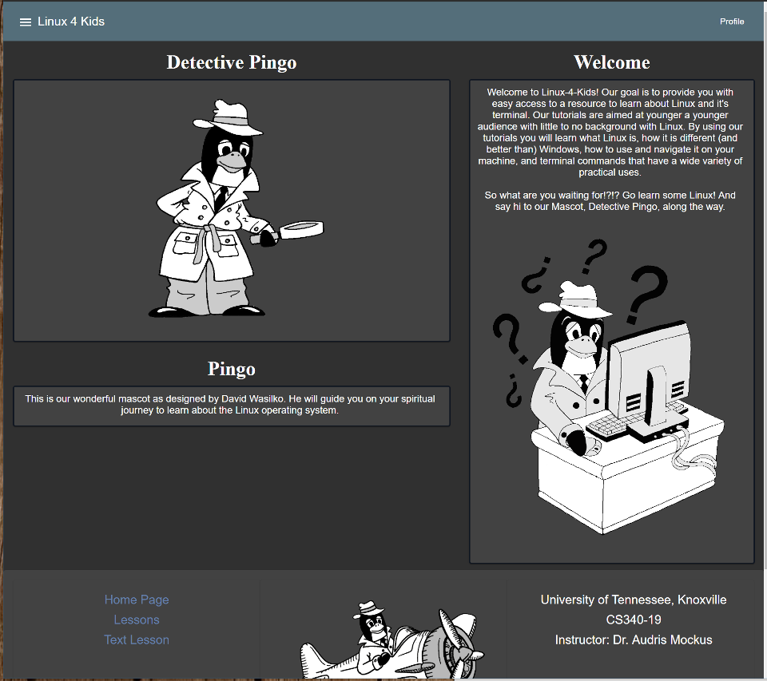
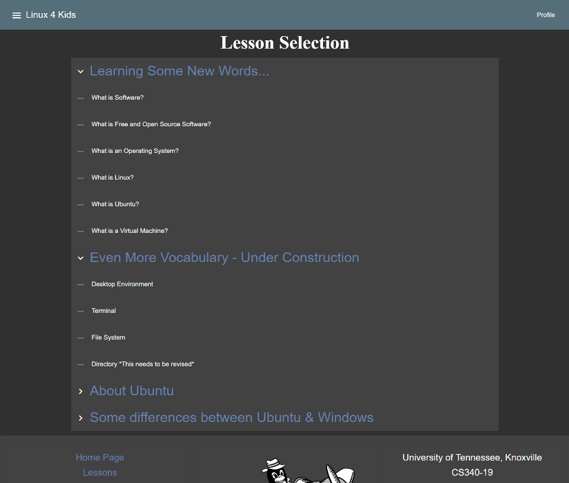
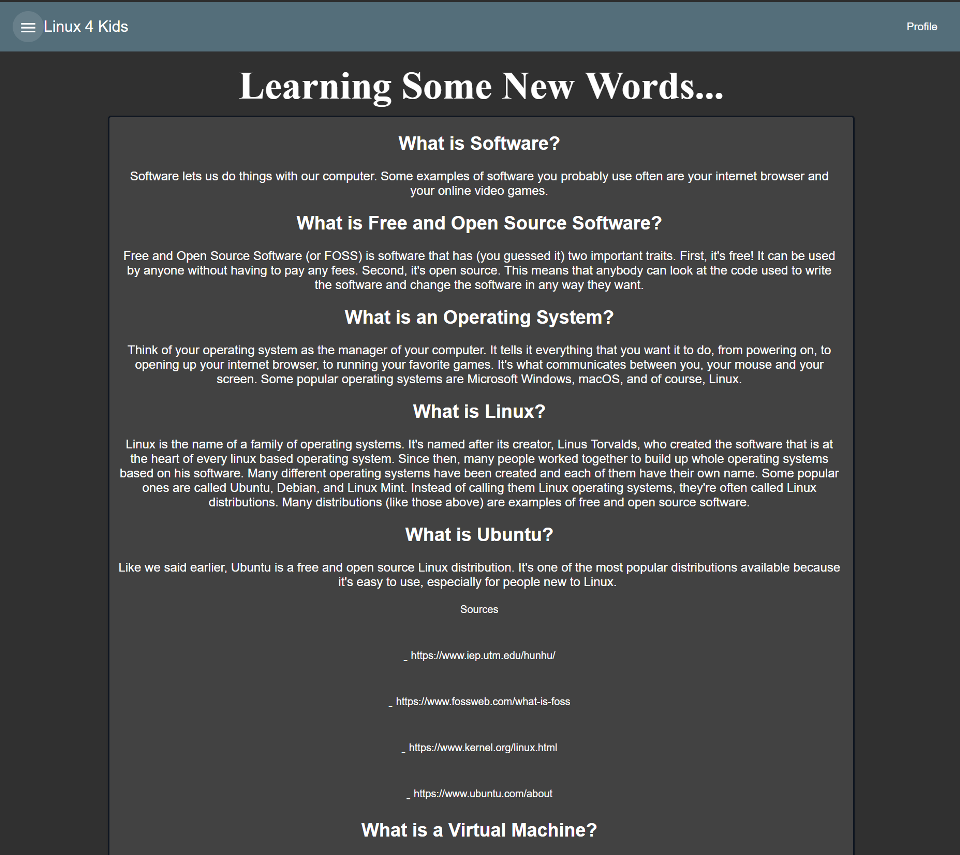

# Linux-4-Kids: A Web-based Guided Learning Platform

Members: Alexis Engelvin-Grezes, David Wasilko, Jacob Samar, and Russell Derby
___

### Overview

  Our website, Linux-4-Kids, is an educational website meant to get young people interested 
in using a Linux distribution for their everday computing. We found that there were almost
no resources that offered this, so that was the impetus for this project. We envisioned
a website that made learning to use Linux fun and easy for people of all ages. 
  
  Linux-4-Kids has established a strong foundation for our educational website. We have
accomplished many of our original goals and addressed new issues that have come up
along the way. By dividing up tasks and aspects of the project according to individual
experience and skill sets, we have been able to implement a MVP website. Many lessons
have been learned about the work and our team has a clear idea about what needs to
happen for the rest of the semester. To date, we have completed several original
design elements for the website, created the framework for both the website and the
backend, developed multiple lesson plans for the curriculum, and added both structural
and style components to the website.

  In the final weeks of our project development, we realized we had to cut back on a few of our goals. 
Perhaps the most drastic change to our plans was to scrap our back end development. This meant we would 
not be able to create a user profile system like we originally intended to. We also had to rethink our 
websites design, and Jacab Samar & David Wasilko created an html parser in order to solve the problems we 
found. Also, we were unable to host the site as we originally planned to. The problem stemmed from difficulties 
in finding a platform to host our website because none of us had experience in this area. In hindsight, we would 
have put more time into finding a solution for this.

  In the end, we were able to accomplish several of our main goals. The website is functional
and anyone who uses it has access to a basic linux tutorial. Thanks to the design efforts of our 
front end developer & illustrator, the website has an ambience suitable for a younger audience.
We were able to meet most of our sprints, however, some of our more ambitious goals had to be
scrapped, such as user profiles. Also, some of our easier goals were not met, such as hosting our 
website. In retrospect, we were not able to meet these goals due to the inexperience of our team. 
We learned that in the future we need to dedicate more time to learning new technologies when
we begin projects so that we can easily meet the projects basic goals.

### Customer Value - No changes

As was stated in our project proposal, our goal is to provide an educational website to
teach children the basics of Linux, including things like standard usage, commonly used
software, and the history of the service. This is not a unique product. The main way we 
hope to distinguish our platform from others is in the interactive nature of the design, 
as well as by having games and activities throughout in order to make the program feel
more like fun that education.

Our goals in that regard have not changed. However, within the scope of our timeline and
considering the experience of our team members, the interactivity is more than likely what
will be lacking by the deadline. Much of our remaining time will be spent in polishing the
look and feel of the website and adding new features as well as content. So while our goals
have not changed, we are tempering our expectations.

### Technology
  
  Since our update on our project technology in our status report, we we focused on a few goals. The 
first was improving the design and visual appeal of the website. Another was to figure out hosting issues 
as well as various other technical issues. We also intended to implement a user profile system as well as
a terminal emulator for command line lessons. 
 
  In the end, the website design was improved and was able to be run locally. The creation of the 
html parser was successful, as well as the creation of the sidebar (which was used to help 
improve website navigation). More illustrations were added to the website to enhance the relaxed
mood we wanted. 

  We were unable to implement user profiles. Using MongoDB was challenging for the whole team as none
of us had any experience with back end development. It would be our top priority if we were to resume 
work on the website because we believe it is important for users to be able to save their progress.

  In our status report, we express that we wanted to set up automated testing for our website. This
after various efforts to do so, we decided to table the goal. We ended up testing our website
manually. We also got people unfamiliar with the website to test it out. 

Here is a look at the main page of the website.

This is a screenshot of the sidebar.

This is what each lesson page looks like.

### Team

  Our front end developer, Jacob Samar, contributed more than other team members
thanks to his extensive front end development efforts. In hindsight, we would change
the structure of our project development plan to ensure all members work on all parts
of the website (front end, back end, and content) so that no one person bears the entire
load of the development effort. Our backend developer, Russell Derby, had trouble with
MongoDB which led to us scrapping our plans for a back end system entirely. We believe
this problem could have been remedied by, again, distributing resposibilites across
everyone. David Wasilko & Alexis Engelvin-Grezes worked on website content, with David 
creating the illustrations & Alexis writing the website content. All of us worked on writing
sections of the various reports for our respective topics of development as well as
our final presentation. We had no central team leader. In the end, team roles were mostly static.

### Project Managment

  Because of the wide scope of our project, as well as the fact that it could be continually 
added to and improved upon in dozens of ways, from the beginning we have been planning on 
simply taking the project as far as we could with the time and manpower that we have. And to
that end, we will continue to add and polish until the very end. Going forward our main goals
will be to continue to improve the look and feel of the site, implement the user profiles,
and continue to add to the lesson content.

  We believe there are several reasons we missed our goals. The first is inexperience.
Trying to learn not just new technologies but new skills was time consuming. We were 
too ambitious with our goals & should have put more energy in to meeting the basic 
requirements of our website, such as getting it hosted. We also wish we had distributed 
the work more equally. We had a disparity in this because one of our team members was
more experienced in web development than all others. This meant they did most of the 
website development, so this is also why we did not meet some of our goals on time.
If we could have all dedicated time to working on each part of the website, rather than
selecting one person to work on one task for the whole development period, we probably 
could have accomplished more.

### Reflection

  Throughout our project, our team worked well together. We were all cooperative and made 
ourselves available as best we could. We communicated through a group chat, which we 
believe was the best way to communicate with each other in real time on the project. 
Because of our good communication, we were able to recognise when certain goals were not
going to be met, and we were able to re-adjust our project accordingly. Also, we all had to 
learn new things for this project, and while we still did not meet some of our goals because 
of several learning curves, everyone gave a good effort to try to do something new. 

  In the end, our website design worked out nicely. Thanks to revisiting the front end
design in the third sprint, the website layout and navigation was improved. Also, several
new illustrations were added that set our website apart and made its atmospere unique & fun.

  Based on the things we learned during this project, we would change the way we developed
this website. If we continue work in the future, we will split the tasks so that each person
works on each part of the website, so no person ends up doing all of the work on one part. We 
found that having one person work on each task led to an uneven time commitment because certain
tasks took longer (particularly front end and back end development). 

  We believe our project was a success in all aspects but the technical. We failed in our
attempts to implements various technical aspects of our website. We wanted it to be more expansive
and to have more features. We wanted to use automated testing for our website, but due to time
constraints this was not used.

However, we succeeded in many others ways, mainly in the things we 
learned for future project development. We learned that project development is truly a team 
effort and everyone needs to try to contribute in all aspects of the project. We also learned we 
need to treat goal setting for our projects with more caution, as making goals that are too
ambitious can make meeting even basic goals harder. Any future projects we take on will benefit
from the experience we gained working on Linux-4-Kids.

  

  

