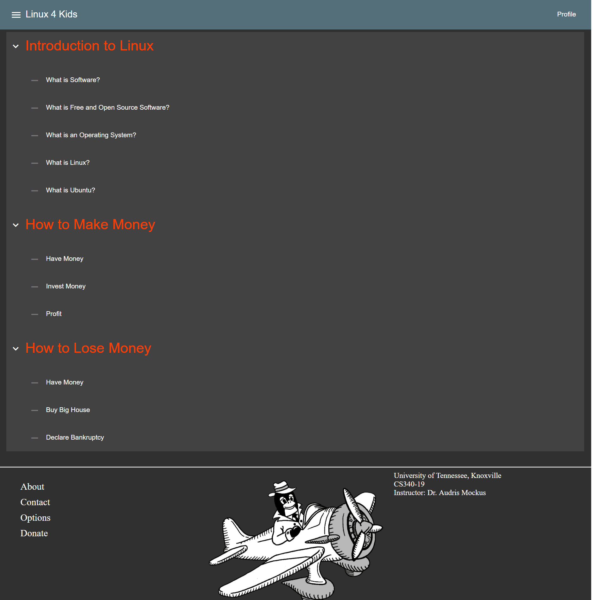
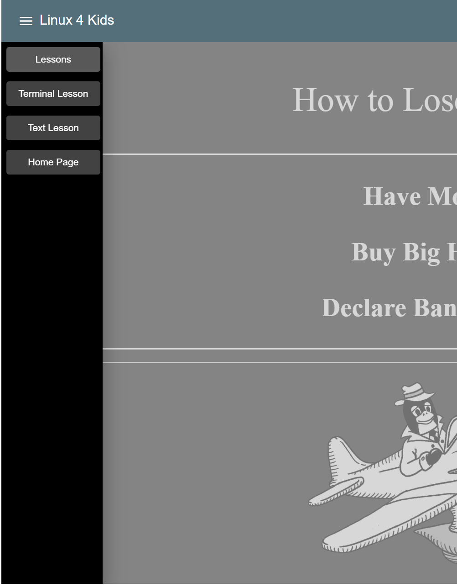
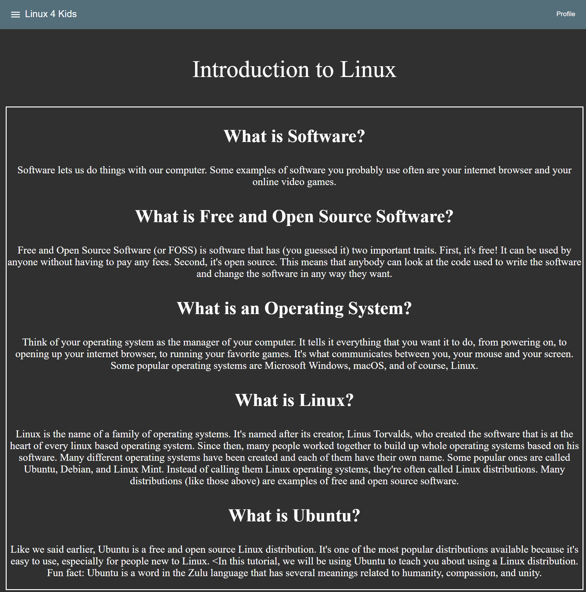

# Linux-4-Kids: A Web-based Guided Learning Platform

Members: Alexis Engelvin-Grezes, David Wasilko, Jacob Samar, and Russell Derby
___

### Introduction

Linux-4-Kids has established a strong foundation for our educational website. We have
accomplished many of our original goals and addressed new issues that have come up
along the way. By dividing up tasks and aspects of the project according to individual
experience and skill sets, we have been able to implement a MVP website. Many lessons
have been learned about the work and our team has a clear idea about what needs to
happen for the rest of the semester. To date, we have completed several original
design elements for the website, created the framework for both the website and the
backend, developed multiple lesson plans for the curriculum, and added both structural
and style components to the website.

  A significant majority of the work has fallen upon one of our team members so far.
Linux-4-Kids has been in conversation this week about how we are addressing this issue.
With that in mind, it has become clear that our team would benefit from some
improvements to our communication practices. Individual members have been isolated
and working alone on tasks, without enough check-ins or collaboration. We plan to
spend more time working side by side and setting more frequent meeting times for
discussion and exchange of information.

  There have been no significant changes to the requirements of the project, but we
have realized that we need to redistribute responsibility and assignment of tasks
going forward. All team members will be contributing to the code of the website pages.
The visual design has not been changed thus far, but it could see some small adjustments
once the rest of the team members are actively developing the website styles. The most
substantial tasks that need resolution are to finalize the hosting platform details and
to complete the user profile and sign-in features of the website. We believe these
changes to the organization and the completion of remaining tasks to complete the
project are all within reasonable expectations for the time we have.

### Customer Value

As was stated in our project proposal, our goal is to provide an educational website to
teach children the basics of Linux, including things like standard usage, commonly used
software, and the history of the service. This is not a unique product. The main way we 
hope to distinguish our platform from others is in the interactive nature of the design, 
as well as by having games and activities throughout in order to make the program feel
more like fun that education.

Our goals in that regard have not changed. However, within the scope of our timeline and
considering the experience of our team members, the interactivity is more than likely what
will be lacking by the deadline. Much of our remaining time will be spent in polishing the
look and feel of the website and adding new features as well as content. So while our goals
have not changed, we are tempering our expectations.

### Technology

Our project has made substantial progress in implementing a MVP of our website using 
our selected tools. It has been created using Angular 7 and the Material 2 UI library.
The goal of our implementation has been to follow Angular's best practices as much as
we are able. What this entails is writing our code without using deprecated syntax,
implementing functions according to their standards, and most importantly compartmentalizing
and generalizing the components we use. That last bullet point means that we have
written much of our site in a way that doesn't require us to duplicate code. We have
used Angular's feature of transclusion to write the portions of the UI that are
persistent across the site (the top navigation bar, the sidebar, and the bottom bar)
only a single time. We have also created general components, such as our text-container
(which styles a title and packages a text body in a container), that we have been
able to use in many different locations. This reduces the amount of work we are
required to do, as well as keeping our styling consistent throughout the site.

We aimed to have the full UI completed at this point allowing us to focus on styling,
bug fixing, and implementing the more optional features of our project. We ever so
slightly missed that goal. We have a couple of more pages to complete before we can
transition to that portion of the project. Although we missed our goal, we are
satisfied with what we have created, so it is not lost time.

We have implemented a tree list for our lesson selection page that can accommodate
a variable number of lessons and sub-lessons.

Our sidebar navigation is well styled for the most part and correctly links to
different portions of our site.

Our lesson page takes information from our lesson objects array and dynamically
styles it according to its length and parts. All that is needed is to add another
lesson to our array and it will be populated onto our site. No hard coding each lesson.

Unfortunately, other than general navigation debugging and attempting to break our
site, we have done no tests. Automated testing is a priority as soon as the UI is finished.

As we have mentioned, our next goals are to style the application, create tests
for various portions of the site, and start adding our more optional features. We
have not decided the order, but our options include the following:
  - Adding mongoDb as our database to store user profiles and lesson progress
  - Creating a lesson creation page that would allow users (admin users as the
    next next feature) to create lessons without coding
  - Further implementing our terminal-lesson to better emulate Linux commands

### Team

Samar - I'd like to get the whole team working more on adding code changes
to components and styling. I've set up most so far with a little help since I
have experience, but I should be able to outline specific tasks now that everyone
can do since we now have a well-laid basic framework for our project.

Engelvin-Grezes - I worked on writing the lessons for this iteration. I fell behind on
writing them and my main goal for the next iteration will be catching up. I would also like
to help with creating the website itself.

Wasilko - My role during this iteration was to design and provide original
illustrations for the website. I have completed three of these drawings that can
be used now, without worries about copyright issues. Going forward, I plan to shift
away from drawing and contribute code and styling. Early on, I sketched up a design
for the website layout, but hope to more effectively style and structure visual
aspects of the website.

Derby - During this iteration my goal was to implement user profiles using mongodb. I was
unsuccesful in accomplishing this by our team's established deadline. Within the next few
days I will be making another concerted effort to get the profiles functional and hosted
on the mongo database. In addition, I hope to assist Jacob in the continued stylization of
the site.

### Project Managment

Due in part to the fact that the majority of our experience is concentrated in only one of 
our team members, the project has not progressed as quickly as could be hoped. In particular, 
our user profile feature is well behind schedule, and will need significant progress to become 
functional. Despite this, we expect to have at least basic user profile functionality 
implemented by the time of our final presentation. In addition, our site is functional as a 
whole and there is a great framework for expanding on components such as lesson content, 
stylization, and interactive content such as the emulated Linux terminal and other games and 
activities.

Because of the wide scope of our project, as well as the fact that it could be continually 
added to and improved upon in dozens of ways, from the beginning we have been planning on 
simply taking the project as far as we could with the time and manpower that we have. And to
that end, we will continue to add and polish until the very end. Going forward our main goals
will be to continue to improve the look and feel of the site, implement the user profiles,
and continue to add to the lesson content.

### Reflection

What went well:
  - All members of the team are active and cooperative.
  - There is good communication between team members.
	- The website design 
		- The website was designed to be simple and easy to navigate for a young audience 
	- Learning new skills & technologies 
		- Everyone in the group has worked hard to learn new skills/technologies for their part of the website.
	- Project planning 
		- Everyone in the group stayed on top of their goals & re-evaluated them promptly if they were not able to meet them.
What was difficult:
	
  - Some technical details of the project were challenging.
		- We had problems figuring out how to host our website.
		- Understanding the framework used to create the website design posed some challenges.
    - Implementing the user profiles feature will take longer than expected.
	- Some parts of the project were very time consuming, such as formatting the website with css.
	- Overall, we underestimated the amount of time & work that would be required for various features.
Areas to improve:
	
  - Reasses our goals for the website based on our time constraints & adjust them accordingly
	- Further improve skills needed to build the website
  - Make sure to meet all milestones & deadlines
  - Start helping each other with other parts of the website 

	
