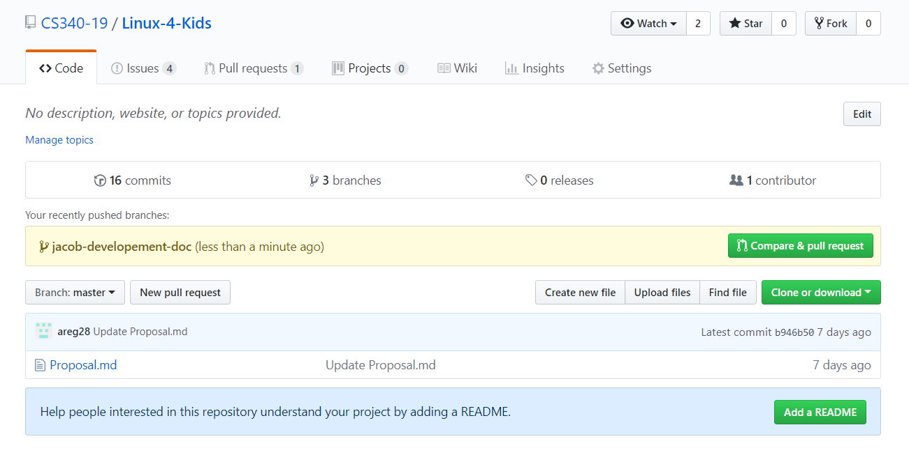

## Development Workflow
___
### Creating Pull Requests
1. Read your issue and create a branch of master with the format of `name-description`. If I was to work on an issue fixing a typo on the home page I would run this command while in the master branch:   `git checkout -b jacob-homepage-typo`  
2. Create your changes and commit them using a reference to the issue and a descriptive
commit message.
3. Now you can push to the remote git repository. This takes the form of `git push --set-upstream origin jacob-homepage-typo`
4. Once it is pushed up, go to the repository homepage and click the compare and pull request in the middle of the screen.

5. If at all possible add more of a description inside your pull request and wait for someone else to review and merge it, rather than doing it yourself.

___

### Reviewing Pull Requests
1. If the pull request is something needed to be tested you can get the source code by starting on the master branch, running `git fetch && git merge`, and then `git checkout name-of-their-branch` (i.e. `git checkout jacob-development-doc`)
2. If anything needs to be changed add a comment on the PR referencing the code in question.
3. When ready to merge, squash and merge their PR and delete the branch when it has been merged into master.

___

### Running Website Locally

#### For First Install - ([Walkthrough](https://angular.io/guide/quickstart))
1. Will need to install the latest Node LTS at [this location](https://nodejs.org/en/download/)
2. Install Angular CLI: `npm install -g @angular/cli`

#### For Running the User Server
More info to come about this. But you don't need to download Mongo unless you want to host or work on the user server, specifically.
1. Install MongoDB: [Link] (https://www.mongodb.com/dr/fastdl.mongodb.org/win32/mongodb-win32-x86_64-2008plus-ssl-4.0.6-signed.msi/download)
2. Be Continued

#### Every Time After
1. From linux4Kids directory cd into source: `cd src`
2. build your dependencies (so far there are none but that will change): `npm install`
3. Run locally: `ng serve --open`  
the --open automatically builds the website at localhost:4200
